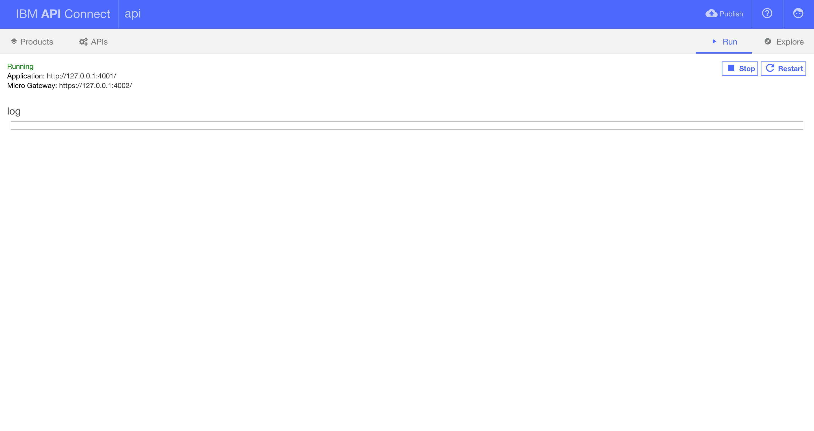
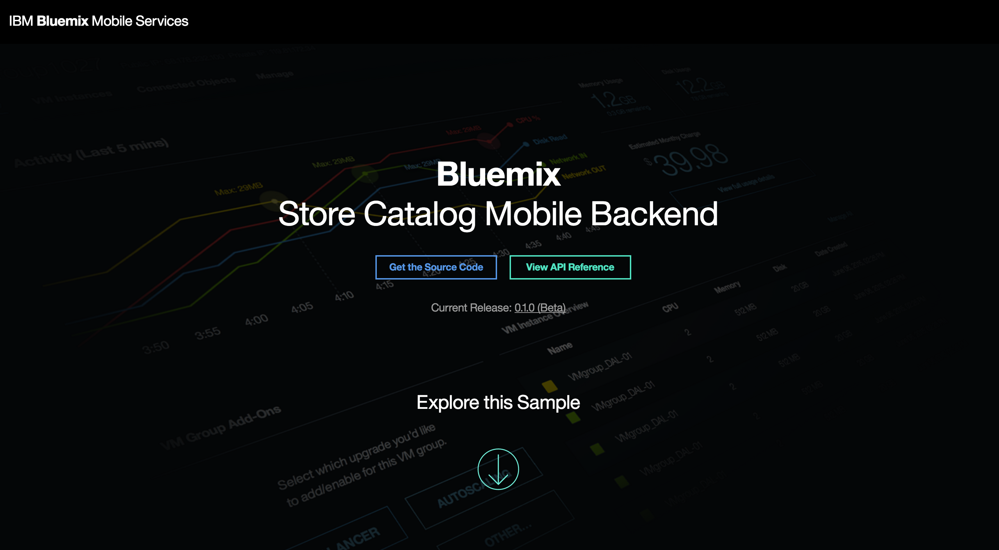

# Store Catalog Mobile Backend
This folder contains instructions for how to run API Connect, connect your sample to the datasources that you created earlier, and deploy the sample on Bluemix.

### Before you begin
Ensure that you have:

* Provisioned your Bluemix application by following the instructions in the [provision/](../provision) folder
* Supplied data to your Bluemix application by following the instructions in the [data/](../data) folder
* The [API Connect CLI](https://www.npmjs.com/package/apiconnect) tool installed
* Confirmed that you are still in the right region, organization, and space by running `cf target`

### Directory structure
    ├── api                     # Top directory of the API Connect application
    │   ├── client              # Contains the frontend files for the landing page for the backend application route on Bluemix
    │   ├── definitions         # Auto-generated .yaml files from API Connect that contain API definitions
    │   ├── server              # Parent directory that contains all of the routing, loopback, modules, installation, etc. files
    |   │   ├── boot            # Contains routes.js which establishes our Object Storage proxy router
    |   │   ├── install         # Contains two installation scripts: one recovers your VCAP_SERVICES from Bluemix while the other auto-generates a Cloudant connector to API Connect
    |   │   ├── models          # Auto-generated model files from API Connect
    |   │   ├── modules         # Contains our custom Object Storage module which authenticates to the service and pipes out a requested image
    |   │   ├── ...             # Misc.
    |   │   └── server.js       # The primary server file of the sample
    │   └── package.json        # Contains name, version, description, scripts, dependencies, etc. of the application

### Installation
1. Ensure that you are logged into the correct region in Cloud Foundry.
2. Run `npm run local` which will download your `VCAP_SERVICES` environment variable from Bluemix and write it to the file named `env.json` (This way we can have the Node application use `env.json` as an environment variable when we run our application locally. It stores the credentials that are necessary to authenticate to our Bluemix services).
3. Run `npm install` to download all of the required dependencies.
4. Run `npm run datasources` to connect your Cloudant datasource to API Connect.  

   **Note:** The [`datasources.js`](api/server/install/datasources.js) file 
   is also configured in the [`package.json`](api/package.json) to run
   post install. When the backend is pushed to Bluemix, the file runs so
   API Connect can successfully connect to Cloudant. It might be necessary 
   to modify or remove this file for your own project (e.g. if your database 
   isn't called `products`, or if you choose to generate the connector a 
   different way).

### Running API Connect
To run API Connect, type the following command while inside the [api/](api) directory:

`apic edit`

Browse through the tabs to familiarize yourself with the sample.

Click the **Run** tab in the top right hand corner to start the server. After the server is started, click the **Explore** tab to see and test the API.

**Note:** The Object Store proxy router will not render images until you publish your application to Bluemix.

### Publishing to Bluemix
To publish your local application to Bluemix, use the command:

`cf push`

This will use the `manifest.yml` file that was generated when we provisioned the application to upload the project on Bluemix.

### Using the Store Catalog Backend and API
You will see a Store Catalog Backend when you visit the application route. A landing page displays information about this sample.

> Click **View API Reference** on the web UI to see the API specs.
