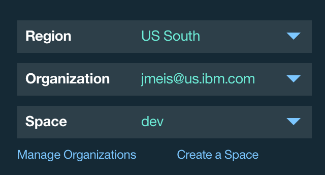

# Store Catalog Mobile Backend Provisioning
This folder provides instructions on how to easily create a Bluemix application with all of the necessary services for the App Builder Commerce Demo.

### Before you begin
Ensure that you have:

* A [Bluemix](http://bluemix.net) account
* The [Cloud Foundry CLI](https://www.ng.bluemix.net/docs/cli/downloads.html) tool installed

### Provisioning a backend
To provision a backend on Bluemix, perform the following steps:

#### Getting set up with Bluemix

1. Make sure that you have an [IBM Bluemix](https://console.ng.bluemix.net/) account.
2. Make sure that you have the [Cloud Foundry CLI](https://www.ng.bluemix.net/docs/cli/downloads.html) tool installed.
3. Open terminal and run `cf --version` to verify that the `cf` tool is available.
1. Setup the `cf` tool to work with a Bluemix API server of your choice. For example:

	`cf target https://api.ng.bluemix.net`

	> Use following URLs for other Bluemix regions:

	> US-SOUTH `https://api.ng.bluemix.net`

	> UNITED KINGDOM `https://api.en-gb.bluemix.net`

	> SYDNEY `https://api.au-syd.bluemix.net`

1. Login with your Bluemix credentials and run `cf login` to pick your organization and space.
1. Run `cf target` to ensure that you are in the right region, organization, and space.

#### Provision the backend
1. Fill out the `TARGET`, `SPACE`, `REGION` and `NAME` variables in the `create.sh` shell script.
2. Run `cf target` to easily find the correct values of the `TARGET`, `SPACE`, and `REGION` variables.

	After running `cf target`...

	```
	TARGET will be the Org variable (usually email).
	SPACE will be the Space variable.
	REGION will be the API Endpoint variable.
	```

	You can verify this if necessary by using the Bluemix UI:
	

For the previous example:

<!-- ```bash -->
```
TARGET=jmeis@us.ibm.com
SPACE=dev
REGION=https://api.ng.bluemix.net
```

This script dynamically generates the `manifest.yml` file and the services you need to create and push your backend to Bluemix. **Make sure to verify that the NAME is unique!** Deploy by issuing the command:

```
sh create.sh
```
