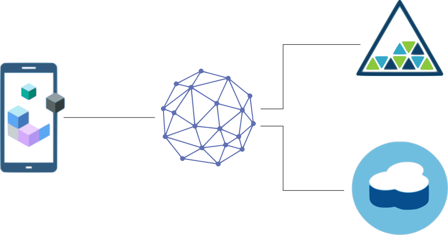

# Mobile Backend for Bluemix
### IBM App Builder Store Catalog Backend
The Store Catalog Mobile Backend prepares a Bluemix Backend using  **API Connect**, **Cloudant NoSQL DB**, and **Object Storage** services on Bluemix. The backend exhibits common architectural design patterns that developers can use to model their backend on Bluemix for mobile applications. This backend has been created to support the IBM Mobile App Builder Store Catalog Mobile Application template.

This repository contains an example of a backend that would be created for the IBM Mobile App Builder Store Catalog template mobile application. It has the the ability to browse a list of products and also supports the viewing of product images for each item available at a store.

The backend uses the following IBM Bluemix Services:

1. API Connect for a single point of REST integration
2. Cloudant NoSQL DB to hold a list products in a NoSQL structure
3. Object Storage to store product images.

### Architecture

## Configuring the Backend

The backend can be easily installed using the `bluegen` command line tool. This CLI tool logs you into Bluemix and prepares the backend services for use. It automatically provisions the services and populates them with the test data required to get up to speed quickly.

### Before you begin
Ensure that you have:

* The [Cloud Foundry CLI tool](https://github.com/cloudfoundry/cli) installed
* The [API Connect CLI tool](https://www.npmjs.com/package/apiconnect) installed by typing the command:

	`npm install -g apiconnect`
* The [Bluemix Generator CLI tool]() installed by typing the command:

	`npm install -g bluegen`

### Create your backend

1. Run the following command in the root directory of your cloned project. This will create the required services on Bluemix and populate them with the necessary test data:

	`bluegen`

2. Navigate to your newly created projects folder.
3. Upload your API Connect backend to Bluemix by typing these commands:
    
	`cf login [-a API_URL] [-u USERNAME] [-o ORG] [-s SPACE]`

	`cf push`

4. If you want to configure or extend your backend you can edit the API configuration locally by running the commands:

	`npm install`

	`apic edit`

### License
This package contains sample code provided in source code form. The samples are licensed under the Apache License, Version 2.0 (the "License"). You may obtain a copy of the License at http://www.apache.org/licenses/LICENSE-2.0 and may also view the license in the license file within this package.
