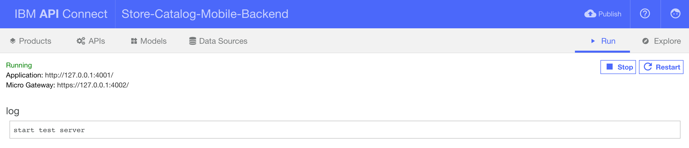
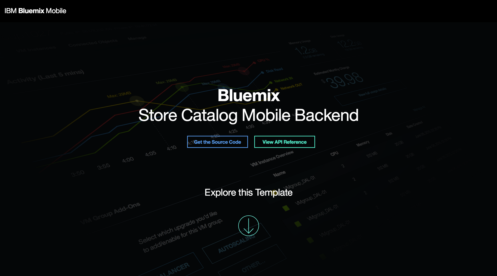

# Store Catalog Mobile Backend
This folder contains instructions for how to run **API Connect** and deploy the template to Bluemix.

### Before you begin
Ensure that you have:

* The [Cloud Foundry CLI tool](https://github.com/cloudfoundry/cli) installed
* The [API Connect CLI tool](https://www.npmjs.com/package/apiconnect) installed by typing the command:

	`npm install -g apiconnect`

### Directory structure
    ├── client              # Contains the frontend files for the landing page for the backend route on Bluemix
    ├── common
    │   ├── models          # Auto-generated model files from API Connect
    ├── definitions         # Auto-generated .yaml files from API Connect that contain API definitions
    ├── server              # Parent directory that contains all of the routing, loopback, modules, installation, etc. files
    │   ├── boot            # Contains routes.js which establishes our Object Storage proxy router and our protected Mobile Client Access endpoint
    │   ├── modules         # Contains custom modules for Mobile Client Access and Object Storage
    │   ├── utils           # Contains VCAP utility that returns credentials from the current environment (either env.json or Bluemix environment)
    │   ├── ...             # Misc.
    │   └── server.js       # The primary server file of the template
    ├── env.json            # Copy of the VCAP_SERVICES from Bluemix (allows the template to run locally)
    ├── manifest.yml        # Used by Cloud Foundry to upload your project to Bluemix and bind the services to your backend
    └── package.json        # Contains name, version, description, scripts, dependencies, etc. of the backend

### Running API Connect
To run **API Connect**, type the following command while inside the project directory:

`apic edit`

Browse through the tabs to familiarize yourself with the template.

Click the **Run** tab in the top right hand corner to start the server. After the server is started, click the **Explore** tab to see and test the API.

### Publishing to Bluemix
To publish your local application to Bluemix, use the command:

`cf push`

This will use the `manifest.yml` file that was generated when we provisioned the application to upload the project to Bluemix.

### Using the Store Catalog Backend and API
You will see a Store Catalog Backend when you visit the application route. A landing page displays information about this template.

> Click **View API Reference** on the web UI to see the API specs.
